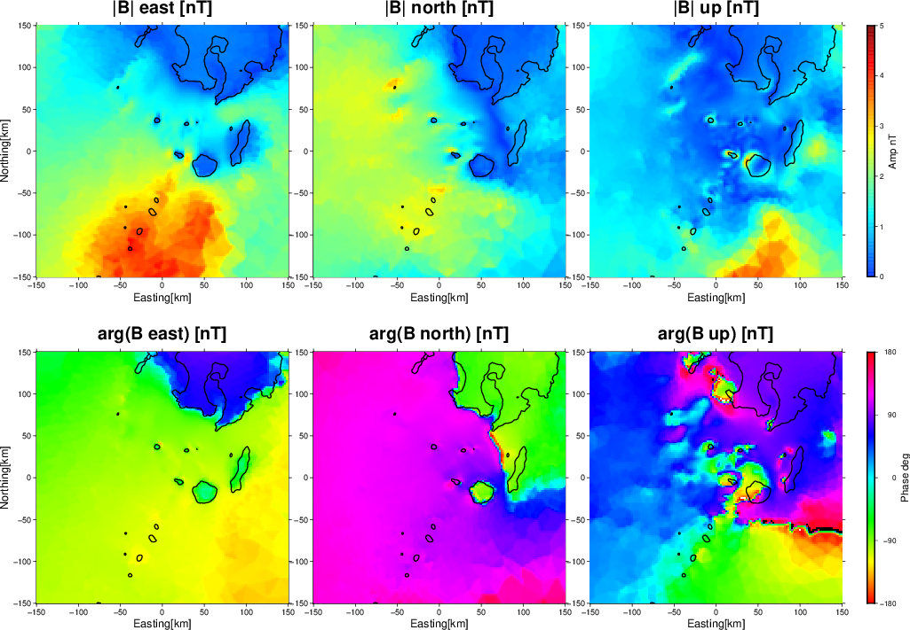
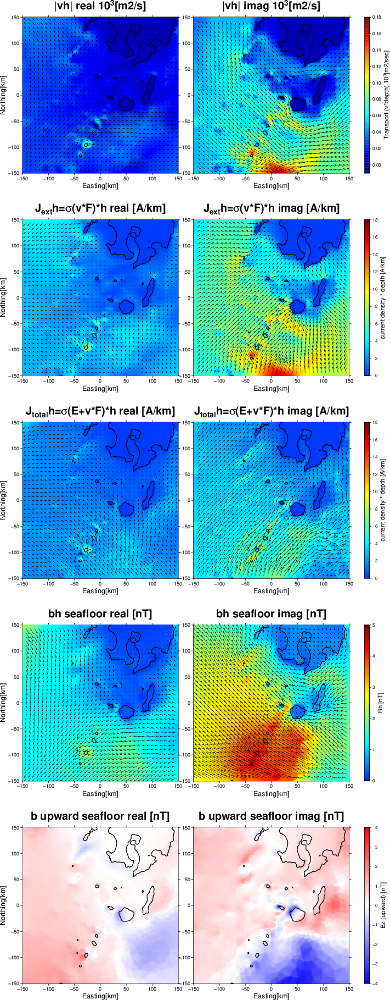

# Manual of ActFEMtide
## Finite element simulation code for tide-induced electromagnetic field

#### As of July 23, 2026

Takuto MINAMI
tminami@port.kobe-u.ac.jp
(Graduate School of Science, Kobe University)

### Contents

1. [Introduction](#Introduction)
2. [Important notes](#ImportantNotes)
3. [Required environments](#Required_environments)
4. [Run sample simulations](#Run_sample_simulations)  
 - Sample 1: [Kikai](#Tohoku_small)

## 1 Introduction 
__ActFEMtide__ is a simulation code for calculating tide-generated electromagnetic fields via electromotive force in the ocean. The main solver is based on __ActFEM__ [(Minami et al. 2018)](#Minami2018) with the replacement of the source term of electric dipole source by tidally-induced electromotive force ($\mathbf{v}\times \mathbf{F}$).
__ActFEMtide__ is written in fortran and uses intel-math-kernel library (mkl) for the use of a sparse direct solver, PARDISO. ActFEMtide can use openMP for parallel computation with PARDISO, and MPI for parallel computation for multiple frequencies.
__ActFEMtide__ uses the meshgenerator developed for __TMTGEM__ [(MInami et al. 2017)](#Minami2017).
ActFEMtide is composed of two parts: 1: Mesh generation part, 2: Simulation part. __ActFEMtide__ is currently assume to use the output of tide model by [(Egbert and Erofeeva, 2002)](#EE2002).
__ActFEMtide__ uses [Gmsh](https://www.soest.hawaii.edu/gmt/) for mesh generation and the extrude algorithm described in [Oishi et al. (2013)](#O2013), which was originally developed for __TMTGEM__. Most of the subroutines for extrusion are from a fluid simulation open-source code, [Fluidity](http://fluidityproject.github.io/).

Note that there are many copied contents from __TMTGEM__ manual (v1.3).

## 2 Important notes 
Coordinate system: X: eastward, Y: northward, Z: upward

__Solved equations:__ Refer to [Minami et al. (2018, EPS)](#Minami2018) (with modification to $\mathbf{v}\times \mathbf{F}$ source)

__Input topography data:__ lon [deg], lat [deg], alt [m, __Downward Positive__]

__Assumed tide model:__ [Egbert and Erofeeva (2002)](#EE2002)

## 3 Required environment 
Please make the following packages installed in your PC:

- __Gmsh__ [(http://gmsh.info/)](http://gmsh.info/) for mesh generation

- __Intel fortran compiler with mkl library__ (confirm you can use “ifort –mkl=parallel ***”)

- __GMT__ ([generic mapping tool](https://www.soest.hawaii.edu/gmt/)) for vieweing simulation results
ghostscript (only for “gv” commands, e.g. in plot_z.sh in TMTGEM/Tohoku/flow)

If you can use Debian Linux distributions, "sudo apt install ***" help you install all the environments above.

## 4 Run sample codes in "Kikai/" 
Run ActFEMtide anyway!! 
In the home folder of ActFEMtide/, the folder named Kikai/ is that for example simulations.
To run the sample codes there are run by several steps.

### Step0 Preparation of tide model 
Compile the code [(Egbert and Erofeeva, 2002)](#EE2002) in ActFEMtide/mkfvxyz/
####  
    $cd mkfvxyz
    $cd OTPS
    $make           (compile the codes for use of tide model)

If you are working in triton, copy data by the folloiwng command in ActFEMtide/mkfvxyz/OTPS/
####
    $./wget.sh
Please confirm that in the DATA folder, the following files are prepared:

### Step 1: "Preparation of topo" (ActFEMtide/Kikai/topo/)
#### convert etopo grd file to ascii *.xyz file. 
    $cd Kikai/topo
    $./mk_etopo_kikai.sh        (etopo_kikai-l.xyz is generated)

### Step 2: Generation of Tetrahedral mesh (ActFEMtide/Kikai/mesh/)
#### Generation of tetrahedral mesh 
    $cd ../mesh
    $./tetmeshgen.sh             (em3d.msh and others are generated)
It takes a while dependent on the spec of your PC. Many files are generated but the key three dimensional tetrahedral mesh file is "em3d.msh". Please download the mesh file to local, and check it by the folloing step.

### Step 3: Check the generated mesh files
#### After downloading the contents in ActFEM/Kikai/mesh
    $gmsh em3d.msh

If you generate the mesh successfully, you can see the mesh.

## Step 4: Preapre tidal flow and background magnetic field
####
    $cd ../fvxyz
    $./mkfvxyz_mesh.sh

## Step 5: run ActFEMtide
####
    $cd ../fwd
    $./run_fwd.sh

## Step 6: check the results
    $./plot_bxyz.sh
    $./plot_ixyh.sh
You can geenrate two pdf files below.

Figure 1. Tidally-induced magnetic fields due to M2 tide. All the three components are the values at the seafloor. The figure is generated by plot_bxyz.sh.

Figure 2. Real and Imaginary values of magnetic and electric fields due to M2 tide. The gifure is generated by plot_ixyh.sh.

## References
- Egbert, G. D., & Erofeeva, S. Y. (2002). Efficient inverse modeling of barotropic ocean tides. Journal of Atmospheric and Oceanic technology, 19(2), 183-204.
- Minami, T., Utsugi, M., Utada, H., Kagiyama, T., & Inoue, H. (2018). Temporal variation in the resistivity structure of the first Nakadake crater, Aso volcano, Japan, during the magmatic eruptions from November 2014 to May 2015, as inferred by the ACTIVE electromagnetic monitoring system. Earth, Planets and Space, 70(1), 138. 
- Minami, T., Toh, H., Ichihara, H., & Kawashima, I. (2017). Three‐Dimensional Time Domain Simulation of Tsunami‐Generated Electromagnetic Fields: Application to the 2011 Tohoku Earthquake Tsunami. Journal of Geophysical Research: Solid Earth, 122(12), 9559-9579. 

